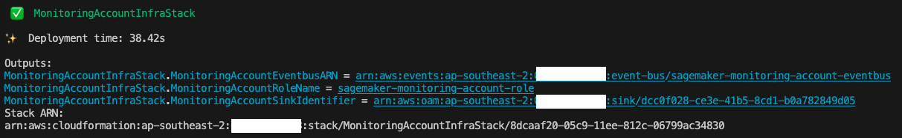

## SageMaker Centralized Monitoring and Reporting

A solution to enable centralized monitoring of SageMaker jobs and activities across multiple AWS accounts. This aims to assist operation team to have a highlevel view of all SageMaker workloads spread in multiple workload accounts from a single pane of glass. It also has an option to enable the [Amazon CloudWatch Cross-Account Observability](https://aws.amazon.com/blogs/aws/new-amazon-cloudwatch-cross-account-observability/) across the SageMaker workload accounts to provide access to monitoring telemetries such as metrics, logs and traces from the centralized monitoring account.

## Tools required
- [Node.js](https://nodejs.org/en/download/) 14.15.0 or later
- [AWS CLI Version 2](https://docs.aws.amazon.com/cli/latest/userguide/getting-started-install.html)
- [CDK Toolkit](https://docs.aws.amazon.com/cdk/v2/guide/cli.html)
- [Docker Engine](https://docs.docker.com/engine/install/) (in running state when performing the deployment procedures)

## Solution Architecture

### Centralized Events Collection
Amazon SageMaker has native integration with the [Amazon EventBridge](https://docs.aws.amazon.com/eventbridge/latest/userguide/eb-what-is.html), Amazon EventBridge monitors status change events in Amazon SageMaker. EventBridge enables you to automate SageMaker and respond automatically to events such as a training job status change or endpoint status change. Events from SageMaker are delivered to EventBridge in near real time. SageMaker events monitored by EventBridge can be found [here](https://docs.aws.amazon.com/sagemaker/latest/dg/automating-sagemaker-with-eventbridge.html). In addition to the SageMaker native events, AWS CloudTrail publishes events when you make API calls, which also streams to Aamzon EventBridge so that this can be utilized by many downstream automation or monitoring use cases. In our solution, we uses EventBridge rules in the workload accounts to stream both SageMaker service events and API events to the monitoring account's EventBus for centralized monitoring.

In the centralized monitoring account, the events are captured by an EventBrige rule and further processed into in different targets:
* CloudWatch Log Group - all events are stored in here has below purpose:
  * Auditing/Archive purpose (https://docs.aws.amazon.com/AmazonCloudWatch/latest/logs/WhatIsCloudWatchLogs.html)
  * Analyzing log data with [CloudWatch Log Insights queries](https://docs.aws.amazon.com/AmazonCloudWatch/latest/logs/AnalyzingLogData.html). CloudWatch Logs Insights enables you to interactively search and analyze your log data in Amazon CloudWatch Logs. You can perform queries to help you more efficiently and effectively respond to operational issues. If an issue occurs, you can use CloudWatch Logs Insights to identify potential causes and validate deployed fixes.
  * Support use of CloudWatch Insights Query Widget for highlevel operation CloudWatch dashboard/ Add query CloudWatch Insights Query to dashboard or export query results
* Lambda Function
  * Perform custom logic to augment the SageMaker service events. One example is to perform metric query on SageMaker job hosts's utilization metrics when a job completion event is received. This example is supported by the native [CloudWatch Cross-Account Observability](https://docs.aws.amazon.com/AmazonCloudWatch/latest/monitoring/CloudWatch-Unified-Cross-Account.html) feature to achieve cross-account metrics, logs and traces access.
  * Convert event information to metric, certain log format as ingested as [EMF](https://docs.aws.amazon.com/AmazonCloudWatch/latest/monitoring/CloudWatch_Embedded_Metric_Format.html)

---
## Deployment Procedure:
This solution can be used for either AWS accounts managed by AWS Organizations or standalone accounts. The following sections will explain the steps for the 2 scenarios respectively. Please note that within each scenario, steps will be performed in different AWS accounts. For your convenience, the account type to perform the step is highlighted at the beginning each step. 

### Deploy for AWS Organizations environment
If the monitoring account and all SageMaker workload accounts are all in the same AWS Organization, the required infrastructure in the source workload accounts are automatically via CloudFormation StackSet from the AWS Organization's management account. Therefore, no manual infra deploy into source workload accounts is required. When a new account is created or an existing account moved into a target OU, the source workload infra stack will be automatically deployed and included in the scope of centralized monitoring.

#### Step 1: Setup Monitoring Account Resources
To deploy the monitoring account resources, run the following command:
```bash
./scripts/organization-deployment/deploy-monitoring-account.sh
```
Enter the following input values:
| Input | Description | Example |
| -------- | ------- | ------- |
| Home region | This represents the AWS region name where the workloads run | ap-southeast-2
| Monitoring account AWSCLI profile name | [Optional] You can find the profile name from ~/.aws/config. If not provided, uses default AWS creds from the chain | |
| Sagemaker workload OU path | The AWS organization unit path that have the Sagemaker workload accounts. Please keep the "/" at the end | o-1a2b3c4d5e/r-saaa/ou-saaa-1a2b3c4d/ |

Keep a note of the outputs as below. They will be used in next step when deploying management account stack.


#### Step 2: Setup Management Account Resources
To deploy the management account resources, run the following command:
```bash
./scripts/organization-deployment/deploy-management-account.sh
```
Enter the following input values:
| Input | Description | Example |
| -------- | ------- | ------- |
| Home region | This represents the AWS region name where the workloads run. This should be the same as monitoring stack | ap-southeast-2
| Management account AWSCLI profile name | [Optional] You can find the profile name from ~/.aws/config. If not provided, uses default AWS creds from the chain | |
| Sagemaker workload OU ID | Here is just the OU ID, NOT the path | ou-saaa-1a2b3c4d |
| Monitoring Account ID | The account ID of where the monitoring stack is deployed to | |
| Monitoring Account Role Name | Output "MonitoringAccountRoleName" from Step 1 |
| Monitoring Account Eventbus ARN | Output "MonitoringAccountEventbusARN" from Step 1 |
| Monitoring Account Sink Identifier | Output "MonitoringAccountSinkIdentifier" from Step 1 |

#### Clean up
**[Management Account and Monitoring Account]** To tear down the stacks, use the follow commands. Make sure you are using the right AWS account's credential for each of the make command. 
```bash
make destroy-management-stackset # Execute against the management account
make destroy-monitoring-account-infra # Execute against the monitoring account
```
Alternatively, you can login into the monitoring account and management account and delete the stacks from the CloudFormation console

### Deploy to Individual Accounts
Work-in-progress


## Security

See [CONTRIBUTING](CONTRIBUTING.md#security-issue-notifications) for more information.

## License

This library is licensed under the MIT-0 License. See the LICENSE file.

