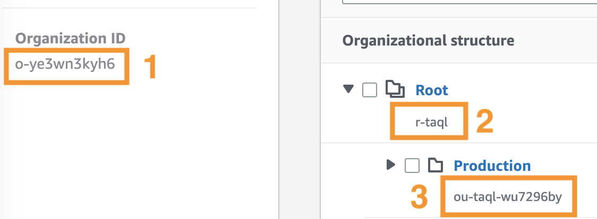
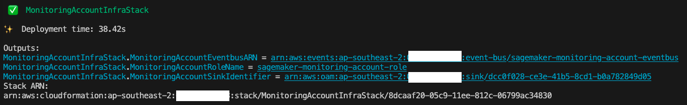

### Deploy for AWS Organizations Environment
If the monitoring account and all SageMaker workload accounts are all in the same AWS Organization, the required infrastructure in the source workload accounts are automatically via CloudFormation StackSet from the AWS Organization's management account. Therefore, no manual infra deploy into source workload accounts is required. When a new account is created or an existing account moved into a target OU, the source workload infra stack will be automatically deployed and included in the scope of centralized monitoring.

#### Step 1: Setup Monitoring Account Resources
To deploy the monitoring account resources, run the following command:
```bash
./scripts/organization-deployment/deploy-monitoring-account.sh
```
Enter the following input values:
| Input | Description | Example |
| -------- | ------- | ------- |
| Home region | This represents the AWS region name where the workloads run | ap-southeast-2
| Monitoring account AWSCLI profile name | [Optional] You can find the profile name from ~/.aws/config. If not provided, uses default AWS creds from the chain | |
| Sagemaker workload OU path | The AWS organization unit path that have the Sagemaker workload accounts. Please keep the "/" at the end | o-1a2b3c4d5e/r-saaa/ou-saaa-1a2b3c4d/ |

To retrieve the OU path, you can go to **AWS Organization** console, under **AWS accounts**, find the below information to construct the OU path. For the below example, the corresponding OU path is `o-ye3wn3kyh6/r-taql/ou-taql-wu7296by/`.
<div>
      
</div>


Keep a note of the outputs as below. They will be used in next step when deploying management account stack.


#### Step 2: Setup Management Account Resources
To deploy the management account resources, run the following command:
```bash
./scripts/organization-deployment/deploy-management-account.sh
```
Enter the following input values:
| Input | Description | Example |
| -------- | ------- | ------- |
| Home region | This represents the AWS region name where the workloads run. This should be the same as monitoring stack | ap-southeast-2
| Management account AWSCLI profile name | [Optional] You can find the profile name from ~/.aws/config. If not provided, uses default AWS creds from the chain | |
| Sagemaker workload OU ID | Here is just the OU ID, NOT the path | ou-saaa-1a2b3c4d |
| Monitoring Account ID | The account ID of where the monitoring stack is deployed to | |
| Monitoring Account Role Name | Output "MonitoringAccountRoleName" from Step 1 |
| Monitoring Account Eventbus ARN | Output "MonitoringAccountEventbusARN" from Step 1 |
| Monitoring Account Sink Identifier | Output "MonitoringAccountSinkIdentifier" from Step 1 |

#### Clean up
**[Management Account and Monitoring Account]** To tear down the stacks, use the follow commands. Make sure you are using the right AWS account's credential for each of the make command. 
```bash
make destroy-management-stackset # Execute against the management account
make destroy-monitoring-account-infra # Execute against the monitoring account
```
Alternatively, you can login into the monitoring account and management account and delete the stacks from the CloudFormation console.